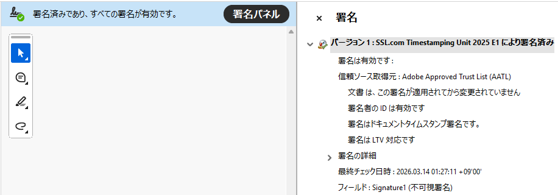
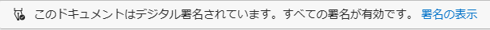
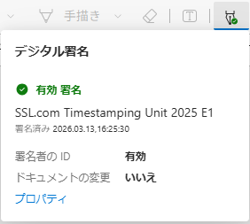

# Timestamped Photo

https://330k.github.io/phototimestamp/

An experimental program that launches the camera in the browser and adds an LTV enabled timestamp signature to the PDF.

While AI is reducing the evidential value of photos, the concept is to create evidential photos by generating timestamp-signed PDFs directly within the browser.

To enhance evidential value, additional information such as UserAgent and Geolocation API is also embedded.

## How to verify PDF

Adobe Acrobat

Edge

## References

* [pdftimestamp](https://github.com/akr/pdftimestamp)
* [CheerpJ](https://cheerpj.com/)
* [jsPDF](https://github.com/parallax/jsPDF)

